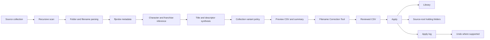

# Rule34 Organizer Design and Naming Baseline

**Baseline version:** 0.5.0  
**Established:** 2026-06-22  
**Status:** Normative product and naming reference

## 1. Purpose

This document records the design choices, naming rules, review policies, and safety guarantees established for the Rule34 Fresh Clip Organizer. It is the baseline against which future parser changes, user-interface work, and retention features should be evaluated.

The organizer exists to turn inconsistent collection downloads into a predictable, searchable personal media library. Its job is broader than renaming files: it combines filename evidence, source-folder context, existing-library precedent, media metadata, configured aliases, and human corrections into an auditable Preview -> Correction -> Apply workflow.

This baseline has four uses:

1. Preserve decisions that have already been made through collection-by-collection review.
2. Distinguish intentional behavior from parser accidents or temporary workarounds.
3. Define regression expectations for future improvements.
4. Explain what makes this organizer different from a generic bulk renamer.

The words **must**, **should**, and **may** are used deliberately:

- **Must** describes a safety or naming requirement.
- **Should** describes the preferred behavior when evidence is sufficient.
- **May** describes optional or configurable behavior.

## 2. Product Scope

### 2.1 In scope

The organizer is responsible for:

- Recursively scanning a newly downloaded collection.
- Reading media properties with `ffprobe`.
- Inferring artist, character, franchise, scene identity, resolution, and variant descriptors.
- Producing exact proposed Windows filenames and destination folders.
- Separating naming from retention decisions.
- Providing a correction interface for human review.
- Moving approved files into the curated library.
- Holding flagged, silent, ambiguous, or superseded files outside the library according to policy.
- Recording every Apply result in a CSV log.
- Reversing supported moves through Undo.
- Learning approved character-to-franchise mappings in a reversible way.

### 2.2 Out of scope

The organizer does not:

- Modify or re-encode media streams.
- Delete source files automatically.
- Overwrite an existing destination file.
- Perform voice recognition.
- Inspect video frames to classify characters, clothing, or content.
- Automatically import files or tags into Stash.
- Treat AI inference as a required dependency.
- Learn voice-actor preferences from Apply operations.

Stash integration remains a downstream operation. The organizer prepares stable filenames and folders so that Stash and other tagging tools can parse the collection reliably.

## 3. Baseline Goals

The organizer should optimize for the following goals, in order:

1. **Safety:** Preview is read-only, Apply never overwrites, and no file is deleted automatically.
2. **Canonical identity:** Artist and character names use one stable spelling and capitalization.
3. **Searchability:** Every accepted filename contains enough explicit identity to be useful without opening the file.
4. **Meaningful distinction:** Variant descriptors replace arbitrary collision numbers whenever evidence permits.
5. **Conservative retention:** Uncertain or optional variants go to review rather than being silently discarded.
6. **Explainability:** A proposed name and decision should be traceable to source evidence.
7. **Generalization:** Fixes should improve all future collections, not only one artist or download layout.
8. **Compatibility:** Existing CSV plans, configuration data, and reviewed workflows remain usable.

## 4. Workflow Architecture



### 4.1 Preview

Preview must be read-only. It recursively analyzes the source collection and writes:

```text
r34_preview_YYYYMMDD-HHMMSS.csv
r34_preview_YYYYMMDD-HHMMSS.md
```

Preview is allowed to read the existing destination library as canonical precedent. It must not move, rename, delete, or rewrite media files.

### 4.2 Correction

The CSV plan is editable directly or through the Filename Correction Tool. Human edits are authoritative for that plan. Editing one field across a multi-row selection must change only that field and preserve each row's other generated values.

### 4.3 Apply

Apply reads the reviewed plan, revalidates paths and statuses, and performs the planned moves. It writes a row-by-row apply log with the original and resulting locations.

### 4.4 Undo

Undo uses the Apply log rather than reconstructing intent. In version 0.5.0 it reverses successful library moves and `held_superseded_variant` moves, including associated character-to-franchise learning changes.

Current limitation: `held_content_review`, `held_silent`, `held_for_review`, and generic quarantine results are logged but are not restored by the current Undo implementation. Expanding Undo coverage is a future safety improvement and must preserve collision handling.

## 5. Naming Contract

### 5.1 Preferred grammar

The accepted output grammar is:

```text
Artist - Scene identity and/or Character - Compact descriptors [RES].ext
```

The most common concrete forms are:

```text
Artist - Character - Scene Title [RES].mp4
Artist - Character - Descriptor [RES].mp4
Artist - Character Scene Title - Descriptor [RES].mp4
```

The conceptual fields are structured even when a character is naturally embedded in the scene title. The character must appear explicitly and canonically, but it must not be duplicated.

Good:

```text
KinkyCat3D - Mercy Halloween - Loop, Spooky Sound Effect [1080P].mp4
HowlSFM - Ada Wong - Nude, NMA, OpaluVA [4K].mp4
AlenAbyss - Tifa Lockhart Halloween - Nude [4K].mp4
```

Bad:

```text
KinkyCat3D Collection 2024 - Mercy Halloween loop 1080p.mp4
Howlsfm - Ada - No Male Audio Nude Version 4K.mp4
AlenAbyss - Tifa Lockhart - Tifa Lockhart Halloween [4K].mp4
```

### 5.2 Exact output requirement

`target_filename` is the exact filename expected to appear in Windows Explorer, including punctuation, capitalization, resolution tag, extension, and compact descriptors.

The correction UI must display the exact output filename separately from the target directory. The target path column must show only the destination directory, not a second copy of the filename.

### 5.3 Separators and punctuation

- Major semantic segments use ` - `.
- Related descriptors within one segment use `, `.
- Bracketed resolution is the final stem component.
- Repeated spaces, hyphens, apostrophes, and malformed punctuation are normalized.
- Windows-invalid filename characters are removed or replaced safely.
- The original extension is preserved in lowercase when it is configured as supported.

### 5.4 Artist names

Artist names must use their canonical brand casing, for example:

```text
HowlSFM
AlenAbyss
KinkyCat3D
JuicyNeko
```

Known artist prefixes in filenames take precedence over inferred collection-folder names. Otherwise, the source root and meaningful parent folders provide artist context.

Generic collection suffixes and packaging text must not become part of the artist:

```text
collection
animations
clips
pack
archive
uploads
downloads
```

Date ranges, catalog spans, and labels such as `Animations 01-30` must also be stripped generically. This is a collection-pattern rule, not an artist-specific exception.

### 5.5 Character names

Characters must use the complete canonical name selected for the library, for example:

```text
Tifa Lockhart
Aerith Gainsborough
Mai Shiranui
Chun-Li
Princess Zelda
Ranni the Witch
Ada Wong
D.Va
2B
```

Character aliases may come from explicit configuration, learned mappings, or established destination-library precedent. More specific and longer aliases should be evaluated before shorter aliases.

The parser must recognize common surface forms:

- Possessives such as `2B's`, `Loba's`, and `Melina's`.
- Compact spellings such as `ChunLi`.
- Common short names that map to canonical full names.
- Multiple characters in one scene.

Descriptor words such as `POV`, `Zero`, and `Whispers` must not be promoted to character names merely because they are capitalized.

Canonical naming is a downstream compatibility decision. If two labels refer to the same intended identity, one canonical form should be chosen so the auto-tagger does not create competing identities.

### 5.6 Multiple characters

Multi-character scenes must retain all confidently identified featured characters. The correction tool must support assigning more than one character through the known-values quick picks.

Multiple names should be represented consistently in the `character` field and rendered without causing the artist or title to be regenerated as numbered placeholders.

### 5.7 Resolution tags

Resolution must be derived from actual video dimensions reported by `ffprobe`, not trusted from filename text.

House labels use uppercase letters:

```text
[8K]
[4K]
[1080P]
[720P]
[480P]
```

The established library labels 1440-class media as `[4K]`. Existing destination-library convention may be used as precedent, but output must remain deterministic.

If resolution cannot be determined safely, the row should require review rather than inventing a label.

## 6. Evidence And Inference Order

The organizer synthesizes names from multiple evidence sources. Their effective priority is:

1. Explicit human correction in the reviewed CSV.
2. Explicit configuration mappings and aliases.
3. Known artist prefix or canonical character alias in the filename.
4. Meaningful source subfolder context.
5. Existing standardized destination-library precedent.
6. Reversible learned character-to-franchise mappings.
7. Conservative dynamic inference.
8. Optional AI assistance for unresolved characters.

Explicit configuration must win over library precedent and AI. AI output is advisory and must not be required for normal operation.

### 6.1 Existing library as reference data

The curated library is treated as a living dictionary of:

- Destination franchise folders.
- Artist spellings.
- Character spellings.
- Character-to-franchise precedent.
- Resolution-label style.

This is powerful but carries a poisoned-precedent risk: an incorrect existing filename can teach a bad pattern. Explicit configuration and human review remain the correction mechanisms.

### 6.2 Confidence

Confidence is composed from artist, character, franchise, title, and resolution evidence. Confidence must guide approval and review behavior; it must not conceal uncertainty behind a plausible-looking filename.

The CSV preserves both aggregate and component confidence so future UI work can explain why a row was accepted or held.

## 7. Folder And Filename Synthesis

### 7.1 Subfolders are semantic evidence

Collection subfolders frequently encode the scene identity while files contain only a variant or clip label. The organizer must inspect both.

Example source:

```text
KinkyCat3D\Mercy Halloween\Loop With Spooky Sound Effect.mp4
```

Expected synthesis:

```text
KinkyCat3D - Mercy Halloween - Loop, Spooky Sound Effect [1080P].mp4
```

The result is not a literal concatenation. It canonicalizes the character, retains the scene identity, extracts the variant, and cleans the connective wording.

### 7.2 Meaningful versus generic folders

Meaningful scene folders should contribute to the title. Generic folders should not:

```text
Animations
Videos
Clips
Exports
MP4
Final
Collection
```

Catalog indexes at the start of a folder or filename, including decimal indexes such as `19.1` and `37.1`, must be removed when they are organizational numbering rather than scene versions.

### 7.3 Semantic delta

When folder and filename repeat the same identity, the organizer should retain only the new information from the filename.

Example:

```text
Folder: Loba Doggystyle
File:   Loba Gettin D.mp4
```

Desired title shape:

```text
Loba Doggystyle - Gettin D
```

Semantic comparison may normalize equivalent forms such as:

- `getting` and `gettin`
- `having` and `havin`
- `fucked` and abbreviated source forms
- `creamy` and related creampie wording where the intended descriptor is clear

This comparison is used to remove repetition, not to rewrite away meaningful distinctions.

### 7.4 Character-bearing scene titles

If a meaningful folder already contains the canonical character once, the renderer should not add a second character segment.

```text
Tifa Lockhart Halloween
```

should not become:

```text
Tifa Lockhart - Tifa Lockhart Halloween
```

### 7.5 Franchise removal

Franchise names belong in the destination folder, not the output filename, unless they are part of a distinct canonical title that cannot be removed without losing meaning.

Canonical character parentheticals must be protected. For example, a configured identity such as `Ballerina (Atomic Heart Android)` must not be damaged by generic franchise stripping.

## 8. Technical Noise Removal

The title cleaner must remove packaging and export residue while retaining scene meaning.

Common removable classes include:

- Calendar dates and upload dates.
- Bare years used as collection labels.
- Collection ranges and catalog prefixes.
- Resolution text already represented by the final resolution tag.
- Frame-rate text such as `60fps`, `75fps`, and `100fps`.
- Encoding or export labels such as high-res, low-res, final, remake, and version packaging noise.
- Watermark labels such as `WM`, `No WM`, and `No Watermark` when they are technical release labels rather than desired variants.
- Collection prefixes such as `Artist Collection To YYYY-MM-DD`.
- Technical-only remnants that do not describe a scene.

Removal must be pattern-based and collection-agnostic. The organizer must not solve prefix pollution with a hard-coded list for one artist.

Before token stripping, malformed connector text should be normalized. For example, source shorthand such as `w'` should be interpreted as `with` where appropriate so meaningful words are not accidentally lost.

## 9. Descriptor Contract

Variant metadata must be parsed before broad title cleanup so that meaningful information is not stripped as noise.

### 9.1 Canonical abbreviations

| Source wording | Output |
| --- | --- |
| No Male Audio, nomaleaudio | `NMA` |
| Standard, default, clothed | `Std` |
| Alternate | `Alt` |
| Point of View | `POV` |
| Alternate Angles | `Alt Angles` |
| Scene 1, Version 1 | `V1` when sibling evidence exists |
| Scene 2, Version 2 | `V2` |

### 9.2 Preserved descriptors

The current vocabulary includes:

```text
Nude
Std
Alt
POV
Alt Angles
Alt Angle
Front Angle
Bonus
Loop
Barelegs
No Hat
No X-Ray
Facesit
Pubes
Bra
No Bra
Full Audio
Full
NSFW
SFW
Cream
Creampie
```

The vocabulary is configurable and should expand through evidence-backed aliases rather than scattered parser exceptions.

### 9.3 Negative descriptors

Negative pubic-hair descriptors are intentionally suppressed:

```text
nopubes
no pubes
No Pubic Hair
```

Positive presence is retained as `Pubes`. In other words, absence is treated as the default and presence is treated as distinguishing information.

### 9.4 Descriptor dominance

When one descriptor already contains the meaning of another, the more specific form wins:

- `No Bra` suppresses `Bra`.
- `Alt Angle` suppresses generic `Alt`.
- `Full Audio` suppresses generic `Full`.
- `Nude` suppresses an inferred `Std` for the same row.

The output must not contain contradictory or nested descriptors.

### 9.5 Dynamic sound variants

Numbered audio or sound alternatives should become meaningful compact labels such as `Sound V2` and `Sound V3` where the source evidence supports that interpretation.

### 9.6 Sex-scene descriptors

Recognizable scene descriptors should be retained and cleaned rather than replaced with arbitrary collision numbers. Scene type is useful search information and often distinguishes otherwise similar files.

The parser should prefer:

```text
Artist - Character - Cowgirl [4K].mp4
Artist - Character - Missionary [4K].mp4
```

over:

```text
Artist - Character 2 [4K].mp4
Artist - Character 3 [4K].mp4
```

## 10. Credits And Audio Performances

Voice and audio credits can be meaningful variant identities. Canonical credit aliases preserve names such as:

```text
OpaluVA
EvilAudio
CinderDryadVA
JellyfishJubi
```

Configured variant-credit aliases override the legacy `audio_credits` stripping list. This allows a credit to remain meaningful for an artist such as HowlSFM while old collector noise can still be stripped elsewhere.

Co-credited names form one unordered performance signature. For retention purposes:

```text
EvilAudio + JellyfishJubi
```

is one performance, not two slots, and the order of names does not create a second performance.

Preferred signatures can be configured globally, by artist, or by artist/character. More specific scope should win. Apply must not alter these preferences automatically.

## 11. Version Inference

Explicit numbered scene families are rendered as `V1`, `V2`, and so on.

Rules:

1. An explicit source `Scene 2`, `Version 2`, `Ver 2`, or unambiguous `V2` may become `V2`.
2. An unnumbered base file may become `V1` only when an explicit numbered sibling establishes a version family.
3. A standalone scene must not gain `V1` merely because it collides with another generated name.
4. Catalog indexes and dates must not be mistaken for scene versions.
5. Frame rates such as `60fps` must not be interpreted as version numbers.

## 12. Variant Policy Engine

### 12.1 Purpose

The variant policy engine makes collection-level decisions after individual files have been analyzed and before final target-name collision handling.

This ordering is essential. A single file can be named plausibly without revealing that a higher-resolution, preferred-audio, or nude/standard sibling exists elsewhere in the same batch.

### 12.2 Family model

Rows are grouped using normalized evidence including:

- Artist.
- Canonical character set.
- Descriptor-free scene core.
- Meaningful source subfolder.
- Explicit scene version.
- `ffprobe` duration.

Each row may carry:

- Version.
- Appearance state.
- Camera state.
- Audio mix such as `NMA`.
- Credit signature.
- Optional or special descriptors.
- Resolution rank.
- Frame rate.
- Duration.
- Confidence evidence.

The public `variant_family` value is a deterministic short identifier for rows grouped during that preview. It is not a permanent Stash relationship ID.

### 12.3 Duration equivalence

Two otherwise equivalent files are treated as duration-equivalent when their difference is no greater than the larger of:

```text
0.5 seconds
2 percent of duration
```

These values are configurable.

`Bonus` and `Loop` files may belong to the same conceptual family despite substantial duration differences, but they are optional review variants rather than automatic replacements.

### 12.4 Selection rules

The current policy is applied conservatively in this order:

1. `content_review` and `silent` statuses retain precedence over ordinary variant decisions.
2. Within an equivalent signature, the highest actual resolution wins.
3. At the same resolution, frame rate and then duration may break a quality tie.
4. Equivalent lower-quality encodes become `superseded_variant`.
5. A different-duration lower-quality file becomes `variant_review`, because it may contain unique material.
6. `NMA` supersedes regular audio only when version, visual state, camera, credits, and duration are otherwise equivalent.
7. Up to the configured number of preferred performance signatures may be retained for an artist/character. The baseline maximum is two.
8. Unknown or excess distinct performances become `variant_review`, not automatic discards.
9. The policy should retain one standard and one nude winner per explicit version when both exist.
10. Unique lower-resolution voice, camera, or appearance variants become `variant_review`.
11. POV, alternate angles, front angles, loops, bonuses, wardrobe differences, X-ray differences, body-detail variants, and SFW/NSFW alternatives become `variant_review` by default.

### 12.5 NMA preference

`NMA` means No Male Audio and is generally preferred. It is not a universal reason to discard another file.

NMA may supersede regular audio only when the two files are otherwise the same performance and visual cut. A separately credited preferred voice performance remains distinct even when another NMA file exists.

### 12.6 Resolution priority

The highest resolution is an almost universal preference, but resolution does not automatically erase unique content. A lower-resolution byte-distinct file with a different camera, appearance, duration, or credited performance must be reviewed unless equivalence is strong.

### 12.7 Collision behavior

Recognized variants must use descriptors instead of sequential filename suffixes. Numeric collision handling is a final fallback only when the organizer cannot find a meaningful distinction.

The variant engine should therefore run before generic target deduplication.

## 13. Status And Apply Matrix

Naming status and retention status are separate. A row can have a valid target filename but remain unapproved for policy reasons.

| Status | Default approval | Apply behavior |
| --- | ---: | --- |
| `ready` | Yes when confidence permits | Move to destination library |
| `unmatched` | No | Leave in source |
| `review` | No | Leave in source; if approved, move to source-root review hold |
| `variant_review` | No | Leave in source; if explicitly approved, move to library |
| `superseded_variant` | No | Automatically move to `_r34_superseded_variants/<run>/` |
| `silent` | No | Leave in source; if explicitly approved, move to `_r34_silent/<run>/` |
| `content_review` | No | Automatically move to `_r34_content_review/<run>/` |
| `blocked` / `duplicate` / `invalid` | No | Do not import |
| `missing_source` | No | Log missing source |

Unapproved ordinary rows remain in place unless the explicit `--quarantine-unapproved` option is used.

The user's current library policy excludes silent clips. The tool still requires explicit approval before moving them to the silent hold, ensuring Preview itself remains read-only.

Content-review classification is a configurable personal-library filter. It is not a claim about universal content taxonomy. The current keyword groups cover categories such as futa, male/male, bisexual, group, BDSM, non-consensual labels, and selected extreme-content terms. Ambiguous broad words should be avoided because they create false positives, as a word such as `monster` can refer to a franchise rather than content.

## 14. Apply Safety Contract

Apply must satisfy all of the following:

- Reconstruct the target from `destination_root`, `target_folder`, and `target_filename` when structured values are available.
- Reject any resolved library target outside `destination_root`.
- Never overwrite an existing file.
- Never silently delete a source file.
- Continue processing and log an error if one row fails.
- Store held files under the source root in a run-specific folder.
- Preserve original and held paths in the Apply log.
- Show `original filename -> resulting filename` during progress.
- Treat destination conflicts as review events rather than destructive replacements.
- Commit learned character-to-franchise data only after a successful approved library move.

The organizer does not re-encode, remux, or modify file contents. Media repair is a separate workflow.

## 15. CSV Data Contract

### 15.1 Preview columns

Version 0.5.0 writes:

```text
approved
source_path
original_name
artist
character
character_confidence
character_reason
clean_title
resolution
target_folder
target_filename
target_path
confidence
artist_confidence
character_confidence_component
franchise_confidence
title_confidence
resolution_confidence
weighted_confidence
variant_family
variant_version
variant_descriptors
variant_credits
variant_decision
variant_reason
variant_rank
status
reason
notes
```

Variant and component-confidence columns are optional when reading old plans. Missing optional fields must default safely so pre-0.5.0 CSV files remain usable.

### 15.2 Apply log additions

Apply logs append:

```text
apply_result
apply_message
original_path
held_path
learned_character
learned_franchise
pre_learned_franchise
```

These fields provide an audit trail and enough state to reverse supported moves and learning changes.

### 15.3 Human authority

The CSV is a review artifact, not merely debug output. User edits to artist, character, franchise, title, resolution, approval, and exact target filename must survive saving and must be visible immediately in the correction UI.

## 16. Filename Correction Tool Contract

The correction tool is the human-in-the-loop control surface. Its established behavior includes:

- Separate columns for original filename, artist, character, franchise, target directory, exact output filename, resolution, variant, decision, status, and approval.
- Logical sorting when a column header is clicked.
- Multi-row partial edits that preserve all untouched fields per row.
- Searchable quick-pick fields for known artists, characters, franchises, and resolutions.
- Typing without focus loss while results filter live.
- Up/Down navigation and Enter autocomplete without Enter applying the edit.
- Adding a new known value when no match exists.
- Removing incorrect known values.
- Assigning multiple characters to one entry.
- Quick-pick Apply actions equivalent to `Apply Correction to Selected Rows`.
- Clearing a quick-pick text field after its value is applied.
- Editing approved status.
- A live change log showing edits made during the correction session.
- A right-click `Show in Explorer` action that opens the source folder and selects the actual file.
- Explicit save to the CSV plan.

Current limitation: the selected-row reset control is not a full restoration mechanism. Closing without saving remains the reliable way to discard an editing session. A future implementation should retain an immutable in-memory snapshot for row-level reset.

## 17. Known Values And Configuration

Configuration in `r34_config.json` is intended to hold stable, explicit knowledge rather than one-run corrections.

Major categories include:

- Destination and holding-folder names.
- Supported video extensions.
- Folder and franchise aliases.
- Artist aliases.
- Character mappings and canonical aliases.
- Collector and generic-folder patterns.
- Title token replacements.
- Content-review terms.
- Legacy audio-credit stripping.
- Variant descriptor aliases.
- Variant credit aliases.
- Preferred performance signatures.
- Variant policy thresholds.

The Known Values Manager provides explicit editing for these categories, including a Variant Policy section. Configuration saves must be backup-first and timestamped. Unrelated JSON keys must survive a focused edit.

No Apply operation may change descriptor aliases, credit aliases, maximum retained performances, or preferred VA rankings.

## 18. Learning Policy

The organizer may learn a character-to-franchise mapping only when:

1. The row was explicitly approved.
2. The file successfully moved to the library.
3. The character and franchise are eligible for learning.
4. The mapping is not an Original Character special case.

The Apply log records the previous mapping so Undo can restore it exactly.

This learning is intentionally narrow. Artist parsing, title rules, content policy, and performance rankings must not silently change based on one Apply run.

## 19. Error Handling And Conservative Defaults

- If an audio probe fails, the organizer assumes audio is present rather than falsely marking a valid file silent.
- If media resolution cannot be established, the row should require review.
- If a character or franchise remains ambiguous, the row should remain unmatched or under review.
- If a target already exists, the source must not overwrite it.
- If an Apply row fails, later rows should still be attempted and the failure recorded.
- If a lower-quality variant may contain unique material, it should be reviewed rather than superseded.

False negatives that require review are preferable to destructive false positives.

## 20. Differentiating Features

The organizer's defining features are not simply bulk rename and move operations. Its distinctive behavior is the combination of:

1. **Folder plus filename synthesis:** scene folders and child filenames are interpreted together.
2. **Canonical-library precedent:** an existing curated library acts as a reference dictionary.
3. **Compact semantic naming:** meaningful descriptors replace release noise and arbitrary numbering.
4. **Collection-wide variant analysis:** decisions compare siblings rather than judging files in isolation.
5. **Configurable performance preferences:** credited VA variants can be retained deliberately by artist and character.
6. **Conservative review routing:** unique lower-quality or optional variants are not silently removed.
7. **Reversible holding folders:** clear losers are moved out of the import path, not deleted.
8. **Exact-output correction UI:** the user sees and edits the precise Explorer filename before Apply.
9. **Partial multi-row correction:** fixing one bad field does not destroy other generated metadata.
10. **Explainable CSV evidence:** confidence components, variant reasons, and apply results remain inspectable.
11. **Offline-first heuristics:** core behavior does not depend on an AI service.
12. **Generalization over exceptions:** collection patterns are normalized broadly instead of accumulating per-artist hacks.

## 21. Known Limitations

The following are accepted limitations of the 0.5.0 baseline:

- Analysis uses filenames, folders, library precedent, configuration, and technical metadata; it does not inspect visual content or recognize voices.
- Variant grouping can fail when scene stems are too vague or source naming is severely inconsistent.
- Incorrect existing-library names can create bad precedent until explicitly corrected.
- Descriptor vocabulary still requires curated expansion.
- There is no content hash or perceptual similarity stage for variant comparison.
- `ffprobe` calls add runtime cost on large collections.
- Quality ranking does not yet fully model bitrate, codec, keyframe health, or visual quality.
- Variant-family IDs are preview-local identifiers, not permanent scene relationships.
- The organizer does not directly write Stash scene metadata.
- AI character inference can be unavailable or inconsistent and is therefore only a fallback.
- Arbitrary collection-number formats may require additional generalized parsing.
- Wardrobe and body-detail taxonomy is intentionally modest.
- The naming renderer is context-sensitive rather than a formal abstract syntax tree.
- Confidence evidence is available in CSV but not yet presented as a rich visual explanation.
- Undo coverage does not yet include every holding result.
- Selected-row reset in the correction tool is incomplete.

## 22. Future Improvement Gates

A proposed change should be evaluated against all of these questions:

### 22.1 Naming accuracy

- Does it improve canonical artist, character, and franchise inference?
- Does it preserve meaningful scene identity?
- Does it avoid duplicated characters or title segments?
- Does it remove technical and collection noise without deleting meaning?

### 22.2 Variant quality

- Does it replace numeric suffixes with meaningful descriptors?
- Does it distinguish equivalent encodes from unique content?
- Does it respect resolution and NMA preferences without discarding distinct performances?
- Does it remain conservative when evidence is weak?

### 22.3 Safety and reversibility

- Is Preview still read-only?
- Can Apply overwrite, escape the destination root, or delete a file?
- Is every move logged?
- Can the operation be undone or safely reviewed?

### 22.4 Compatibility

- Can old CSV plans still be read?
- Are existing configuration keys preserved?
- Does the GUI use the same core logic as the CLI?
- Does a corrected field remain isolated during multi-row edits?

### 22.5 Explainability

- Can a user understand why the name and status were selected?
- Is uncertainty visible rather than hidden?
- Are new aliases and preferences configurable rather than buried in code?

### 22.6 Performance

- Does the improvement avoid unnecessary repeated probes or full-library scans?
- Can results be cached without allowing stale metadata to corrupt decisions?

## 23. Regression Baseline

Representative reviewed collections should be retained as golden regression fixtures where licensing and privacy permit:

```text
HowlSFM
KinkyCat3D
AlenAbyss
Lazy Procrastinator
Megaera-related quarantine samples
```

Every meaningful parser or variant-policy change should verify:

- No collection prefix appears in an output artist or title.
- No catalog index is mistaken for a scene version.
- A standalone scene does not gain `V1`.
- A base scene plus explicit numbered sibling can become `V1`/`V2`.
- Character names are canonical and not duplicated in the title.
- `POV` and other descriptors are not inferred as characters.
- Resolution and FPS release text do not pollute the title.
- `No Bra`, `Alt Angle`, and `Full Audio` do not emit redundant shorter descriptors.
- Negative pubic-hair labels disappear while positive `Pubes` remains.
- Meaningful sex-scene descriptors survive cleanup.
- Clear equivalent lower-resolution variants become superseded.
- Distinct-duration or unique lower-resolution variants go to review.
- NMA only supersedes an otherwise equivalent regular-audio file.
- Preferred credited performances are retained up to policy limits.
- Silent and content-review statuses retain precedence.
- Apply cannot escape the destination root or overwrite a file.
- Apply logs exact original and resulting paths.
- Supported Undo operations restore the original path and learning state.
- Old plans without variant columns remain readable.
- Multi-row correction changes only the selected field.

## 24. Release Validation Checklist

Before a release that changes naming or retention logic:

1. Compile `r34_organizer.py` and `r34_gui.py`.
2. Parse `r34_config.json` successfully.
3. Run the complete organizer test suite.
4. Run `git diff --check`.
5. Generate a read-only preview against at least one reviewed fixture collection.
6. Compare exact output filenames and variant decisions with the golden expectation.
7. Confirm no source files moved during Preview.
8. Test one approved library move, one superseded hold, one conflict, and Undo on disposable copies.
9. Rebuild the portable GUI.
10. Confirm the built GUI displays the current version and current correction columns.
11. Confirm packaged source and configuration match the repository versions.
12. Record any intentional baseline change in this document and the release notes.

## 25. Design Direction

Future development should move toward a more structured internal scene model while preserving the current human-readable output. A useful long-term representation would separate:

```text
artist
characters
scene identity
act descriptors
appearance
camera
audio mix
performance credits
version
technical quality
destination franchise
retention decision
```

That structure would make title rendering, collision handling, Stash tagging, and variant comparison more reliable without changing the preferred filename style.

The core philosophy should remain stable: infer boldly enough to save work, expose the evidence, and act conservatively enough that the user never loses control of the library.

## 26. Glossary

**Canonical name**  
The single approved spelling and capitalization used for an artist or character throughout the library.

**Collection prefix pollution**  
Packaging text such as artist, date range, collection label, or catalog number incorrectly copied into every generated title.

**Descriptor**  
A compact semantic label that distinguishes a scene or variant, such as `NMA`, `Nude`, `POV`, or `Loop`.

**Equivalent signature**  
Files with the same version, meaningful descriptors, performance signature, and compatible duration, allowing quality-based supersession.

**Family**  
A collection-level grouping of files believed to represent variants of the same underlying scene.

**NMA**  
No Male Audio.

**Performance signature**  
The unordered set of canonical voice/audio credits that identifies one audio performance.

**Source root**  
The collection folder selected for Preview. Holding folders are created beneath this root.

**Superseded variant**  
A confidently equivalent lower-quality file that is held outside the library rather than deleted.

**Variant review**  
A file that may be worth retaining because it contains a distinct performance, camera, appearance, duration, or optional scene form.

